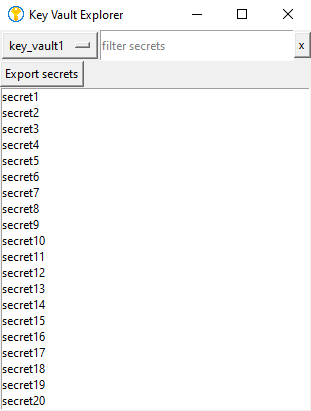

#  Key Vault Explorer

## Overview

A simple tool to explore the contents of an Azure Key Vault.



## Prerequisites

Azure CLI must be installed and you must be logged in.

## Installation

```bash
pip install -r requirements.txt
```

## Configuration

The configuration is stored in a `.env` file. You can copy the `.env.example` file and rename it to `.env`.

### Parameters

| Parameter | Description | Default Value |
|-----------|-------------|---------------|
| `TEST`    | Test mode   | `False`       |
| `PROXY`   | Proxy URL   | `None`        |

## Usage

```bash
python main.py
```
